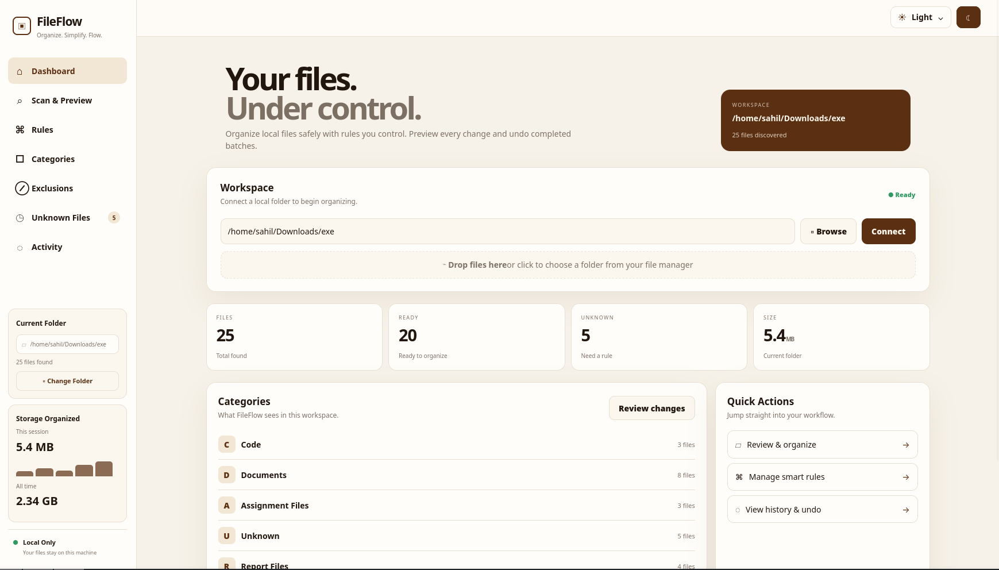
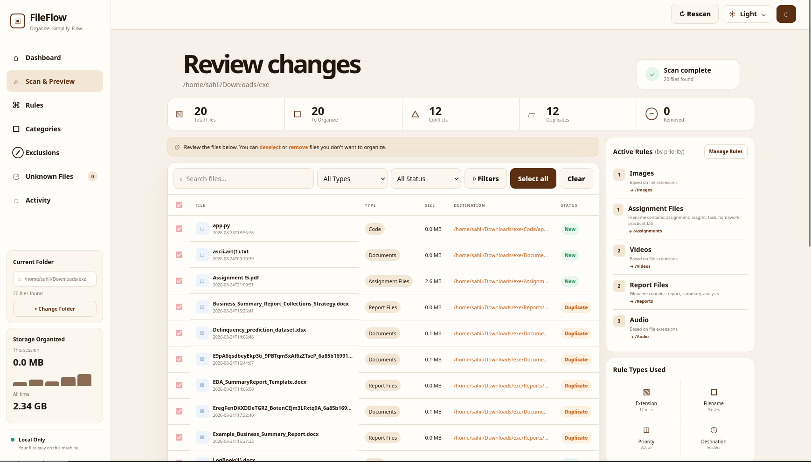
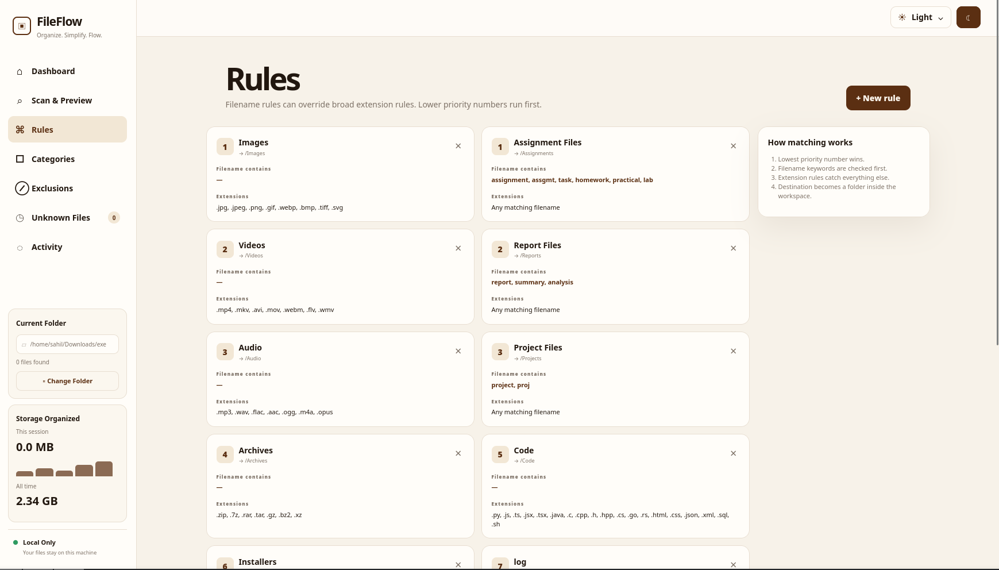
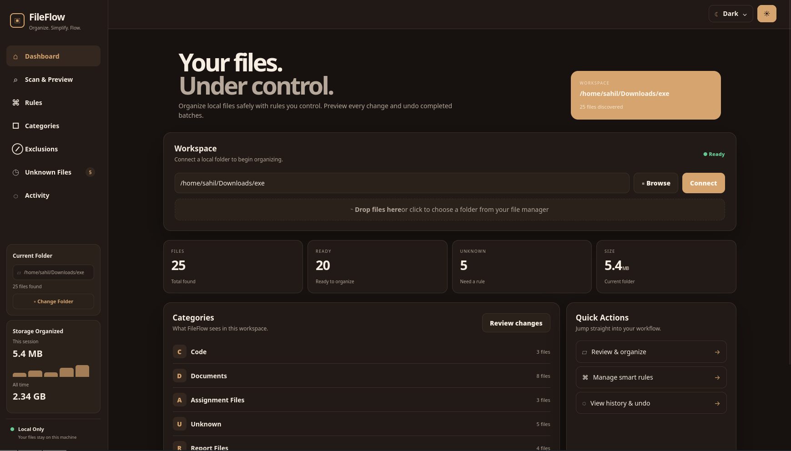
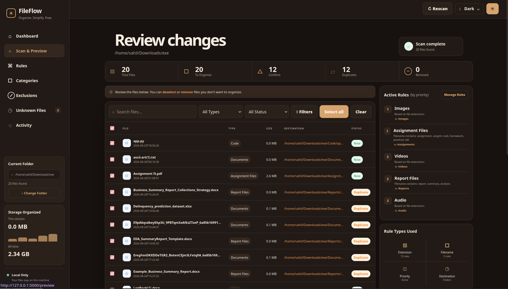
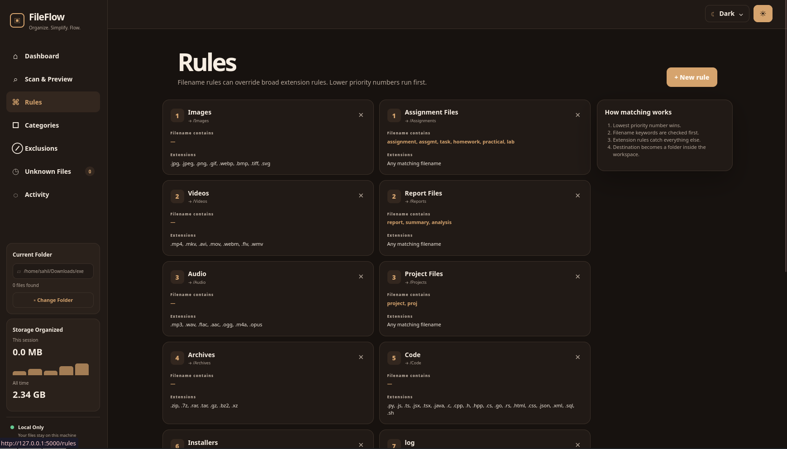

<p align="center">
  
</p>

<p align="center">
  <strong>FileFlow</strong>
</p>

<p align="center">
  <strong>Smart, local-first file organization with rules, previews, duplicate detection, and undo.</strong>
</p>

<p align="center">
  <em>Scan. Review. Organize. Safely.</em>
</p>

<p align="center">
  <a href="#features">Features</a> •
  <a href="#quick-start">Quick Start</a> •
  <a href="#how-it-works">How It Works</a> •
  <a href="#rules">Rules</a> •
  <a href="#architecture">Architecture</a> •
  <a href="#development">Development</a>
</p>

# FileFlow

> Smart, local-first file organization with rules, previews, duplicate detection, and undo.

<p align="center">
  
</p>

<p align="center">
  <strong>Scan. Review. Organize. Safely.</strong>
</p>

FileFlow is a self-hosted web application for automatically organizing
files into meaningful folders without blindly moving everything at once.

It scans a selected local workspace, applies configurable rules,
previews proposed changes, detects conflicts and duplicates, and lets
you choose exactly what should be organized.

**Turn a messy folder into an organized workspace while keeping the user
in control.**

## Features

### Smart file organization

- Scan a selected local folder.
- Organize files by extension.
- Organize files by filename keywords.
- Use rule priorities when multiple rules match.
- Create destination folders automatically.
- Support nested destinations.
- Keep unmatched files visible.

### Review before organizing

FileFlow uses a preview-first workflow:

```text
Select workspace
      ↓
Scan files
      ↓
Apply rules
      ↓
Preview proposed changes
      ↓
Resolve conflicts
      ↓
Select files
      ↓
Organize
```

A scan does not automatically move files. The user reviews the proposed
changes first.

### Filename-based rules

FileFlow can recognize files from their names, not only their
extensions.

For example:

```text
assignment-01.pdf
assignment_python.docx
DBMS-practical-03.pdf
homework-week-4.txt
```

can be routed to:

```text
Assignments/
```

Likewise:

```text
project-report.pdf
final-analysis.docx
monthly-summary.xlsx
```

can be routed to:

```text
Reports/
```

### Rule priorities

Rules can have explicit priorities.

```text
Priority 1   → Assignment Files → Assignments/
Priority 2   → Report Files     → Reports/
Priority 3   → Project Files    → Projects/
Priority 100 → Documents        → Documents/
```

Lower priority numbers are evaluated first.

### Conflict handling

When a destination already contains a file with the same name, FileFlow
supports:

- Rename
- Skip
- Replace

Conflicts are shown during preview.

### Duplicate detection

FileFlow can identify duplicate file contents using SHA-256 hashing, so
files with different names can still be recognized as duplicates.

### Per-file preview control

A file can be removed from the current organization preview without
deleting or moving it.

### Activity history and undo

Organization operations are recorded in activity history and supported
reversible moves can be undone.

### Protected paths

Sensitive locations such as `/`, `/etc`, `/usr`, `/bin`, `/sbin`,
`/boot`, `/System`, and `/Library` are treated as protected paths rather
than ordinary workspaces.

### Native folder picker

On supported Linux desktops, FileFlow can use:

```text
kdialog
zenity
yad
```

The workspace can also be entered manually.

### UI

- Cream/off-white visual system.
- Warm brown accents.
- Professional dark mode.
- Persistent theme preference.
- Sidebar navigation.
- Dashboard overview.
- Review Changes workspace.
- Search and filters.
- File organization statistics.
- Active-rules panel.
- Responsive layout.

## Screenshots

Add repository screenshots such as:

<p align="center">
  
</p>

<p align="center">
  
</p>

<p align="center">
  
</p>

<p align="center">
  
</p>

<p align="center">
  
</p>

<p align="center">
  
</p>


## Quick Start

### 1. Clone the repository

Replace the repository URL with your GitHub repository:

```bash
git clone <your-repository-url>
cd FileFlow
```

### 2. Create a virtual environment

Linux/macOS:

```bash
python -m venv .venv
source .venv/bin/activate
```

Windows PowerShell:

```powershell
python -m venv .venv
.venv\Scripts\Activate.ps1
```

### 3. Install dependencies

```bash
pip install -r requirements.txt
```

### 4. Optional: install a native folder picker on Arch Linux

For KDE Plasma:

```bash
sudo pacman -S kdialog
```

Alternatively, install `zenity` or `yad`.

### 5. Start FileFlow

```bash
python app.py
```

Open:

```text
http://127.0.0.1:5000
```

## How It Works

### 1. Choose a workspace

Select the folder containing the files you want to organize.

You can:

- enter the path manually
- click Browse
- click the workspace area to open the native folder picker

### 2. Scan

FileFlow scans direct files in the selected workspace and ignores
incomplete temporary files such as:

```text
.part
.crdownload
.tmp
```

### 3. Match rules

Each file is evaluated against configured rules using:

- filename keywords
- extensions
- priority
- destination

Example:

```text
assignment_05.pdf
        ↓
filename contains "assignment"
        ↓
Assignment Files
        ↓
Assignments/
```

### 4. Preview

The proposed changes can show:

- file name
- type
- size
- destination
- conflict status
- duplicate status
- organization status

You can search, filter, select, clear, or remove individual files.

### 5. Execute

Click **Organize selected** to create destination folders and perform
the selected moves using the chosen conflict policy.

### 6. Undo

Use Activity history to review organization operations and undo
supported reversible moves.

## Rules

Default smart rules include:

| Rule | Filename keywords | Destination | Priority |
|---|---|---|---|
| Assignment Files | assignment, assgmt, task, homework, practical, lab | `Assignments/` | 1 |
| Report Files | report, summary, analysis | `Reports/` | 2 |
| Project Files | project, proj | `Projects/` | 3 |
| Documents | common document extensions | `Documents/` | 100 |
| Images | common image extensions | `Images/` | 100 |
| Videos | common video extensions | `Videos/` | 100 |
| Audio | common audio extensions | `Audio/` | 100 |
| Archives | common archive extensions | `Archives/` | 100 |
| Code | programming extensions | `Code/` | 100 |
| Installers | installer/package extensions | `Installers/` | 100 |

Specific filename rules can therefore take precedence over broad
extension rules.

### Example

```text
Assignment Files
────────────────
Filename contains:
assignment
assgmt
practical
lab
homework

Destination:
Assignments

Priority:
1
```

A broad PDF rule can remain at priority 100:

```text
Documents
────────────────
Extensions:
.pdf
.docx
.txt

Destination:
Documents

Priority:
100
```

An assignment PDF will therefore go to `Assignments/` rather than
`Documents/`.

## Conflict Policies

### Rename

Keep both files by generating a new destination name:

```text
report.pdf
report (1).pdf
```

### Skip

Leave the existing destination file untouched.

### Replace

Replace the existing destination file with the incoming file.

Use Replace carefully because it can overwrite an existing destination
file.

## Duplicate Detection

FileFlow uses SHA-256 content hashing when duplicate detection is
performed:

```text
file A → SHA-256 → hash X
file B → SHA-256 → hash X

             ↓
        same content
```

Duplicate detection is based on content rather than filename.

## Safety Model

FileFlow is designed around a local-first, review-first workflow.

Important safety behavior includes:

- Preview before execution.
- Explicit file selection.
- Configurable conflict handling.
- Duplicate detection.
- Protected paths.
- Permission/error handling.
- Activity history.
- Undo for supported operations.
- No cloud upload required for normal organization.
- No AI dependency for core organization.

## Architecture

```text
┌─────────────────────────────────────────────────────┐
│                     Browser                         │
│                                                     │
│ Dashboard • Preview • Rules • Activity             │
└────────────────────────┬────────────────────────────┘
                         │ HTTP
                         ▼
┌─────────────────────────────────────────────────────┐
│                    Flask App                        │
│                      app.py                         │
│                                                     │
│ Routes • UI • Config • Theme • Folder Picker       │
└───────────────┬──────────────────────┬──────────────┘
                │                      │
                ▼                      ▼
┌─────────────────────────┐   ┌──────────────────────┐
│      Organizer          │   │      Rule Store      │
│     organizer.py        │   │       rules.py       │
│                         │   │                      │
│ Scan • Preview • Move   │   │ Priorities • Rules   │
│ Hash • Conflicts • Undo │   │ Destinations         │
└────────────┬────────────┘   └──────────────────────┘
             │
             ▼
┌─────────────────────────────────────────────────────┐
│                  Local Filesystem                   │
│                                                     │
│ Workspace → Destination folders                    │
└─────────────────────────────────────────────────────┘
```

## Project Structure

```text
FileFlow/
├── app.py
├── organizer.py
├── rules.py
├── requirements.txt
├── README.md
├── .gitignore
├── templates/
│   ├── base.html
│   ├── dashboard.html
│   ├── preview.html
│   ├── rules.html
│   ├── categories.html
│   ├── exclusions.html
│   ├── unknown.html
│   └── activity.html
├── static/
│   ├── app.css
│   └── app.js
└── data/
    └── ...
```

Adjust the structure if your repository contains additional modules.

## Requirements

- Python 3.10+
- Flask
- Modern web browser
- Local filesystem workspace
- SQLite support from Python/application runtime

For native Linux folder selection, one of `kdialog`, `zenity`, or `yad`
is recommended.

Core file organization does not require an external AI provider.

## Configuration

Typical local configuration includes:

```text
Workspace folder
Theme preference
Organization rules
Rule priorities
Conflict policy
```

Keep generated runtime data out of version control.

Example `.gitignore` entries:

```text
.venv/
__pycache__/
*.pyc
.env
data/
instance/
```

## Development

```bash
python -m venv .venv
source .venv/bin/activate
pip install -r requirements.txt
python app.py
```

For frontend changes, a hard refresh can clear cached assets:

```text
Ctrl + Shift + R
```

Restart Flask after backend changes.

## Testing Checklist

- [ ] FileFlow starts successfully.
- [ ] Workspace can be entered manually.
- [ ] Browse opens the native folder picker when available.
- [ ] Workspace click opens the folder picker.
- [ ] Folder scanning works.
- [ ] Temporary files are ignored.
- [ ] Filename rules work.
- [ ] Extension rules work.
- [ ] Rule priorities work.
- [ ] Destination folders are created.
- [ ] Preview displays correctly.
- [ ] Individual files can be removed from preview.
- [ ] Search works.
- [ ] Type filtering works.
- [ ] Status filtering works.
- [ ] Select all works.
- [ ] Clear works.
- [ ] Rename works.
- [ ] Skip works.
- [ ] Replace works.
- [ ] Duplicate detection works.
- [ ] Permission errors are handled.
- [ ] Protected paths are handled safely.
- [ ] Selected files are organized correctly.
- [ ] Activity history records operations.
- [ ] Undo works for supported operations.
- [ ] Theme switching works on the first interaction.
- [ ] Theme preference persists.
- [ ] Dark mode remains readable.
- [ ] Empty and error states are understandable.

## Known Limitations

- Browser drag-and-drop cannot directly expose arbitrary local
  filesystem paths, so native folder selection is used for graphical
  workspace selection.
- Native folder selection depends on a supported desktop picker.
- FileFlow is primarily designed for local filesystem organization.
- Undo depends on the source and destination remaining accessible.
- Replace can overwrite an existing destination file.
- Flask's development server is intended for local development, not
  production deployment.

## Roadmap

Potential future improvements:

- Advanced rule builder.
- AND/OR rule conditions.
- Date-based organization.
- File-size rules.
- Regular-expression filename rules.
- Exclusion rule builder.
- Unknown-file suggestions.
- Scheduled organization.
- Watch folders.
- Dry-run reports.
- Advanced duplicate management.
- File previews.
- Batch undo sessions.
- Rule import/export.
- Desktop notifications.
- Native desktop packaging.
- Optional local AI-assisted classification.

## Contributing

```bash
git checkout -b feature/my-change
# make your changes
git add .
git commit -m "Add my change"
git push origin feature/my-change
```

When opening a pull request, describe:

- What changed.
- Why it changed.
- How it was tested.
- Limitations.
- Follow-up work.

## Security Notes

FileFlow operates on real files, so filesystem safety matters.

Before exposing an instance beyond your local machine:

- Validate user-controlled paths.
- Prevent path traversal.
- Restrict filesystem access to intended workspaces.
- Resolve destinations safely.
- Handle permissions explicitly.
- Avoid arbitrary command execution.
- Use a production WSGI server.
- Add authentication for multi-user deployments.
- Never commit secrets.

## License

Choose and add an open-source license before publishing FileFlow
publicly.

MIT is a simple option if it matches your intended distribution model.

## Credits

Built with:

- Python
- Flask
- SQLite
- HTML
- CSS
- JavaScript
- Native Linux folder-picker utilities

---

<p align="center">
  <strong>FileFlow</strong><br>
  <sub>Scan. Review. Organize. Safely.</sub>
</p>
